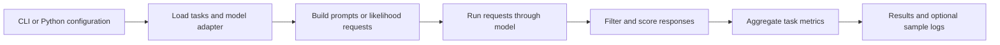

# A human guide to the evaluation harness

The harness asks a model a defined set of questions and scores its responses according to each task's rules. It separates what to ask from how to call a model and how to summarize the answers.

[`lm_eval/__main__.py`](lm_eval/__main__.py) enters the CLI, which delegates to [`lm_eval/_cli/`](lm_eval/_cli/). Python callers can start at `simple_evaluate` in [`lm_eval/evaluator.py`](lm_eval/evaluator.py). It resolves configuration and tasks before calling the evaluation machinery.

[`lm_eval/tasks/`](lm_eval/tasks/) contains task definitions, including many YAML files. A task controls data selection, prompt construction, expected outputs, and scoring. [`lm_eval/models/`](lm_eval/models/) adapts different model backends to the shared interface in [`lm_eval/api/`](lm_eval/api/).

`evaluate` builds requests, collects responses, applies task processing, and aggregates results. [`lm_eval/filters/`](lm_eval/filters/) handles response transformations; [`lm_eval/loggers/`](lm_eval/loggers/) stores outputs. A changed prompt or answer filter can change the score even when the model is identical.

Read one task's YAML and helper functions alongside `evaluator.py`, then the selected model adapter. This is a fork of a broad upstream framework: its thousands of task files are alternatives, not a sequence that every evaluation executes. Model calls, downloads, and optional sample logging occur only when an evaluation is run.
